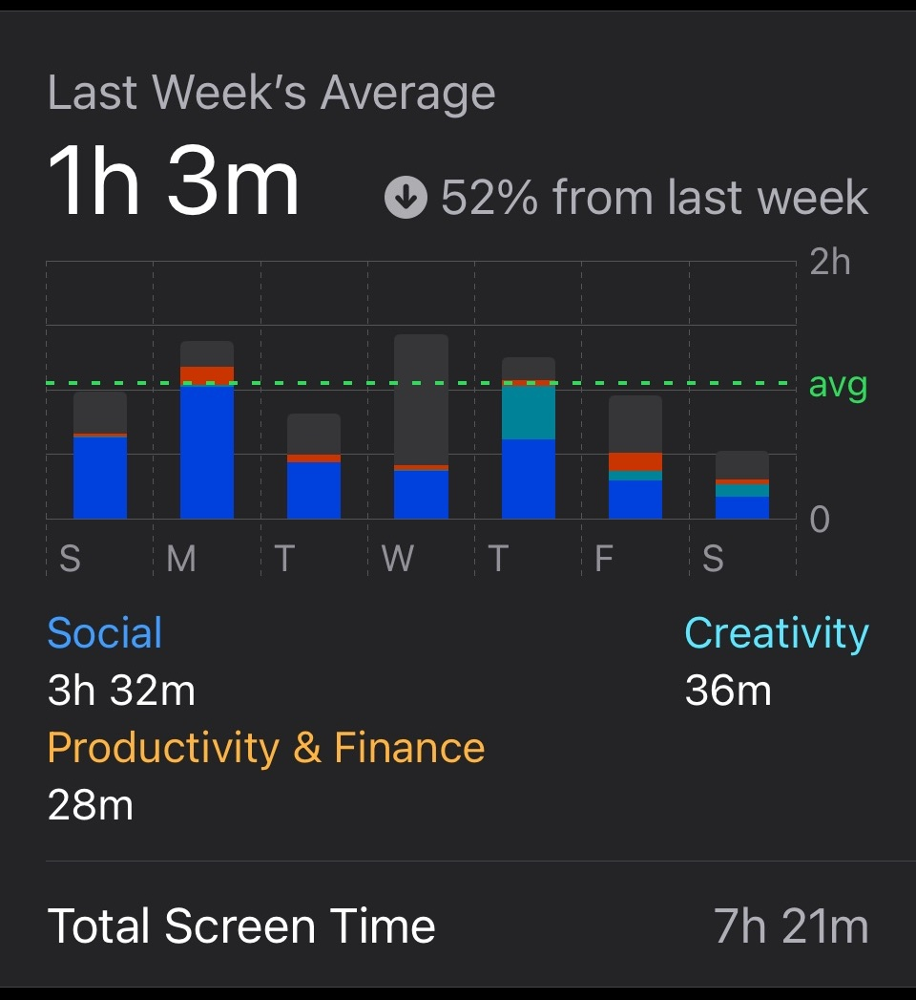
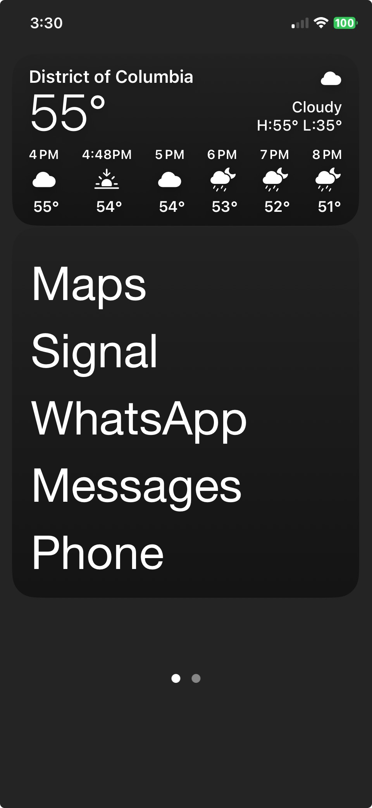

# Digital Minimalism

I identify as a Digital Minimalist. I found the term after reading “How to Break Up With Your Smartphone” by Catherine Price, which inspired me to search online for other techniques to reduce my screentime. From there, I found the [/r/DigitalMinimalism](https://www.reddit.com/r/digitialminimalism) subreddit.

Here are some foundational reasons I feel passionate about this topic:

- I find it unfulfilling to scroll infinitely on my phone/laptop.
- I get more joy and connection through offline (or thoughtfully online) activities.
- I enjoy the beautiful simplicity of analogue (or simple digital) devices not connected to the internet.

On this page, I will catalogue steps I am taking towards Digital Minimalism. At any point, this page may look like a work in progress because so am I.

## Keep My Phone Out of My Bedroom

This step was the easiest and most fruitful for me. I bought a regular alarm clock and charge my phone outside of my bedroom. And it turns out, I have never missed something important because my phone was in the other room.

However. If I am on-call for work (the bane of my existence), I bring my iPhone in for the alerts. Maybe I use my basic tablet just for this.

## Delete TikTok, Twitter, Instagram, and Facebook

I deleted all of these. Not just deleting the app, but deleting the entire account.

I tried to use [Craigslist](craigslist.org) instead of the popular Facebook Marketplace, but it seems like most people have switched over. So this is a bummer. It's made me use Ebay more.

## Keeping Reddit and YouTube?

I use SelfControl to block Reddit/YouTube whenever I feel like I'm on them too much. My compromises:

- Use [old reddit](https://old.reddit.com/) layout
- [Delete my watch history on YouTube](https://support.google.com/youtubemusic/answer/6364666?hl=en), which completely disables recommendations.

## Making My Mac Boring

My goal - by default, my Mac is a blank, black screen. That means:

- Hide the top bar by default
- Hide the Dock
- No apps/files on Desktop
- Black screensaver
- No notifications flashing on the screen _except_ time-sensitive meetings and messages.

With notifications, I like to start with none, then add back what I need. That makes each notification a choice.

## Making My IPhone Boring

Similar to my Mac:

- Hiding everything I can
- No fun backgrounds
- Very few notifications

## The Grayscale Connundrum

Apparently Grayscale reduces engagement. In my experience, I just turn it back to color over time. My compromise is to such a _little_ bit of color from the screen instead.

## Buying a Flip Phone

Next step!!!
