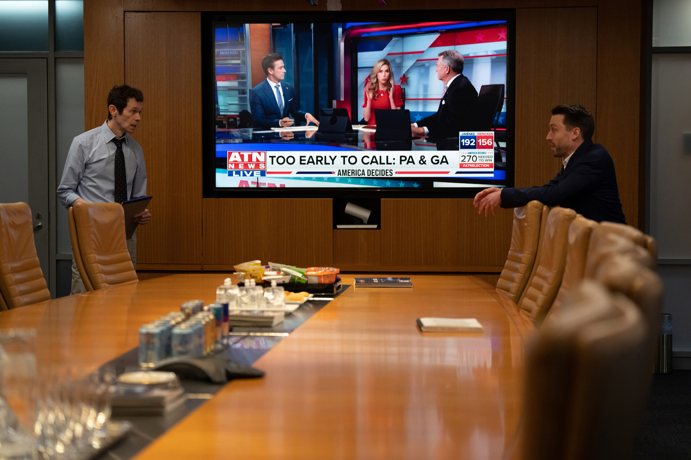

# Yet, What is Any Ocean?

by Jack Nugent
11.4.24

> It's not gonna change anything if I don't go.

- Gregory Hirsch, _Succession_

> My life amounts to no more than one drop in a limitless ocean.

- David Mitchell, _Cloud Atlas_

## Bezos Decides

On October 25th, 12 days before election day, William Lewis, publisher and chief executive offer of _The Washington Post_, made the call that the newspaper will end a well-established, decades-long practice:

> The Washington Post will not be making an endorsement of a presidential candidate in this election.[^1]

Lewis justifies this decision by pointing out that A) The Washington Post did _not_ endorse candidates much before 1976, and B) non-endorsements make the _Post_ more independent, and in turn, more trustworthy.

In his frequent and unspecific use of the word &ldquo;we,&rdquo; Lewis implies this decision was a collective one, but further reporting confirmed the decision came from a single &ldquo;me&rdquo;: owner and billionaire Jeff Bezos. In fact, the Editorial Board already had a draft endorsement written &mdash; &ldquo;we&rdquo; did not decide to &ldquo;[return] to our roots of not endorsing presidential candidates&rdquo; &mdash; Bezos did, and speculations of a conflict of interest arose, including a very coincidental meeting, on the day the piece went live, between Bezos' space company and president candidate Donald Trump. As one Washington Post engineer put it: &ldquo;I'm told it's not what it looks like!&rdquo; [^2]

Readers quickly voted (with their wallets) against the non-endorsement decision: in the following days, the _Post_ lost 250,000, or 10%, of their subscribers. The top comment on a recent /r/washingtondc reddit post summarizes their collective rationale:

> I’m not even against stopping endorsements, but do it outside of the election year, don’t undercut your staff when they’ve got it ready to go, and definitely not after you’ve just met with the person they’re not endorsing. [^3]

Bezos flexed his power by overriding the voices within his newspaper. But the above reddit post also includes, correctly, that is doesn't matter if Bezos controls a newspaper that nobody reads: &ldquo;If their customer base doesn’t make a statement then nothing changes.&rdquo;

There's a power struggle here between owner and consumer. But what about the workers in the newsroom?

## America Decides

_Macall Polay/HBO, and copied from Daily Bruin [^4]_

Season 4, Episode 8 of _Succession_ follows the Roys and their conservative TV station, _ATN_, as they cover the night of a presidential election. Initially, the decisions from the newsroom appear independent from their billionaire-owners: as the employee &ldquo;Decision Desk Darwin&rdquo; exclaims to them, &ldquo;You can't make the call till I make the call.&rdquo;

But, in Bezos-like fashion, the billionaires want to make a controversial call on who won the race, a call with _some_ rationale, but also a call that explicitly serves their own interests over those of editorial independence, appearing to compromise with but ultimately overriding &ldquo;Decision Desk Darwin&rdquo;.

[^1] https://www.washingtonpost.com/opinions/2024/10/25/washington-post-endorsement/

[^2] https://davidchicopham.com/posts/the-expensive-education-of-jeff-bezos/

[^3] https://www.reddit.com/r/washingtondc/comments/1gebkeg/over_200000_subscribers_flee_washington_post/lu8egd5/

[^4] https://dailybruin.com/2023/05/15/succession-season-4-recap-episode-8-america-decides
